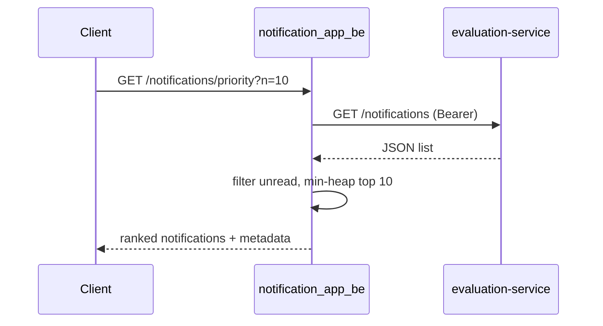

# Notification System Design

## Stage 1 — REST API + Real-Time

### Core actions

| Action | Who | Notes |
|--------|-----|-------|
| List notifications (paginated) | Student | Default: newest first; optional `type` filter |
| Unread count | Student | Lightweight badge for header / mobile |
| Mark one read | Student | Idempotent PATCH |
| Mark all read | Student | Optional bulk endpoint |
| Create notification | Admin / system | Placement, Result, Event |
| Delete / archive | Student or admin | Soft-delete keeps audit trail |
| Filter by type | Student | Query param on list |
| Priority inbox (top N unread) | Student | Stage 6 — see `notification_app_be/` |

All student-facing routes are scoped under `/students/{studentId}/...`. The API gateway (or auth middleware) must verify the JWT subject matches `studentId` before forwarding.

### Authentication headers

```
Authorization: Bearer <access_token>
Content-Type: application/json
```

Admin create/delete routes additionally require a role claim (`admin` or `system`).

---

### Endpoints

#### GET `/students/{studentId}/notifications`

Paginated inbox.

**Query params:** `limit` (default 20, max 100), `offset` (default 0), `type` (optional: `Event` | `Result` | `Placement`), `unreadOnly` (optional boolean).

**Response `200`:**

```json
{
  "studentId": "1042",
  "total": 847,
  "limit": 20,
  "offset": 0,
  "notifications": [
    {
      "id": "d146095a-0d86-4a34-9e69-3900a14576bc",
      "type": "Result",
      "message": "Mid-semester grades published",
      "isRead": false,
      "createdAt": "2026-04-22T17:51:30Z"
    }
  ]
}
```

**Errors:** `401` unauthorized, `403` studentId mismatch, `404` student not found.

---

#### GET `/students/{studentId}/notifications/unread-count`

Badge count only — avoids loading full rows on every page load.

**Response `200`:**

```json
{
  "studentId": "1042",
  "unreadCount": 12
}
```

---

#### GET `/students/{studentId}/notifications/priority`

Top-N unread by business priority (`Placement` > `Result` > `Event`, then newest timestamp). Implemented in code for the assessment; see Stage 6 and `notification_app_be/priority_inbox.py`.

**Query params:** `n` (default 10, max 50).

**Response `200`:**

```json
{
  "studentId": "1042",
  "limit": 10,
  "notifications": [
    {
      "id": "...",
      "type": "Placement",
      "message": "...",
      "timestamp": "2026-04-22T17:51:30Z"
    }
  ]
}
```

---

#### PATCH `/notifications/{notificationId}/read`

Mark a single notification read. Body may be empty.

**Request (optional body):**

```json
{ "isRead": true }
```

**Response `200`:**

```json
{
  "id": "d146095a-0d86-4a34-9e69-3900a14576bc",
  "isRead": true,
  "readAt": "2026-04-22T18:02:00Z"
}
```

**Errors:** `404` not found, `409` already read (optional — can still return 200 for idempotency).

---

#### PATCH `/students/{studentId}/notifications/read-all`

Mark every unread notification for the student as read.

**Response `200`:**

```json
{
  "studentId": "1042",
  "markedRead": 12
}
```

---

#### POST `/notifications`

Admin or internal service creates a notification for one student.

**Request:**

```json
{
  "studentId": "1042",
  "type": "Placement",
  "message": "Infosys drive on 28 Apr — register by Friday"
}
```

**Response `201`:**

```json
{
  "id": "a1b2c3d4-...",
  "studentId": "1042",
  "type": "Placement",
  "message": "Infosys drive on 28 Apr — register by Friday",
  "isRead": false,
  "createdAt": "2026-04-22T10:00:00Z"
}
```

After insert, publish an event to the real-time layer (below) so connected clients update without polling.

---

#### DELETE `/notifications/{notificationId}`

Hard delete (rare). Prefer archive for students.

**Response `204`** No body.

---

#### PATCH `/notifications/{notificationId}/archive`

Soft-delete: hidden from inbox, retained for compliance.

**Response `200`:**

```json
{
  "id": "...",
  "archivedAt": "2026-04-22T18:05:00Z"
}
```

---

#### GET `/students/{studentId}/notifications?type=Event`

Same as list endpoint; `type` filters `notification_type`. Combine with `unreadOnly=true` for “unread events only.”

---

### Real-time delivery

**Choice: WebSocket** at `wss://api.example.edu/ws/notifications`

**Why not SSE or long polling alone**

| Approach | Fit for campus scale |
|----------|----------------------|
| Long polling | Simple but wastes connections; latency spikes under load |
| SSE | One-way server→client is fine for pushes, but browsers cap ~6 connections per host; harder to ack client actions on same channel |
| **WebSocket** | Full duplex, one persistent connection per student session, low latency for badge + inbox updates |

**Flow**

1. Student logs in; client opens `WS /ws/notifications?token=<jwt>`.
2. On `POST /notifications` (or worker insert), API publishes `{ "event": "notification.created", "studentId", "payload" }` to **Redis pub/sub** channel `student:{id}`.
3. Each API instance subscribed to Redis forwards the message to local WebSocket connections for that student.
4. Client merges push into local state (increment unread count, prepend to list, re-run priority heap if on priority view).

**Reconnect:** client sends `Last-Event-Id` or fetches `GET .../notifications?since=<timestamp>` after disconnect to fill gaps.

**Fallback:** if WebSocket unavailable, client polls `unread-count` every 60s and full list on user opening inbox — degraded but functional.

---

## Stage 2 — Database

### Choice: PostgreSQL

Relational model fits student ↔ notification ownership, ACID for read/unread updates, and mature indexing for inbox queries. JSONB columns are available if we need flexible metadata later, but core fields stay typed columns for predictable query plans.

---

### Schema

```sql
CREATE TYPE notification_type AS ENUM ('Event', 'Result', 'Placement');

CREATE TABLE students (
    id          BIGINT PRIMARY KEY,
    name        VARCHAR(255) NOT NULL,
    email       VARCHAR(255) NOT NULL UNIQUE,
    created_at  TIMESTAMPTZ NOT NULL DEFAULT NOW()
);

CREATE TABLE notifications (
    id                UUID PRIMARY KEY DEFAULT gen_random_uuid(),
    student_id        BIGINT NOT NULL REFERENCES students(id) ON DELETE CASCADE,
    notification_type notification_type NOT NULL,
    message           TEXT NOT NULL,
    is_read           BOOLEAN NOT NULL DEFAULT FALSE,
    read_at           TIMESTAMPTZ,
    archived_at       TIMESTAMPTZ,
    created_at        TIMESTAMPTZ NOT NULL DEFAULT NOW(),
    CONSTRAINT chk_read_at CHECK (
        (is_read = FALSE AND read_at IS NULL)
        OR (is_read = TRUE AND read_at IS NOT NULL)
    )
);

-- Inbox: filter by student + read flag, sort by created_at DESC
CREATE INDEX idx_notifications_inbox
    ON notifications (student_id, is_read, created_at DESC);

-- Type filter within a student
CREATE INDEX idx_notifications_student_type
    ON notifications (student_id, notification_type, created_at DESC);

-- Admin / analytics: placement notices in a date range
CREATE INDEX idx_notifications_type_created
    ON notifications (notification_type, created_at DESC)
    WHERE archived_at IS NULL;
```

**Optional:** partition `notifications` by `created_at` (monthly) once row count exceeds ~10M to keep index sizes bounded and speed archival.

---

### Scale problems and mitigations

| Problem | Cause | Mitigation |
|---------|-------|------------|
| Table bloat | Millions of rows per student over years | Archive rows older than 12 months to `notifications_archive`; soft-delete via `archived_at` |
| Slow unread queries | Full table scan without selective index | Composite index `(student_id, is_read, created_at DESC)` |
| Write spikes on notify-all | 50k inserts in one transaction | Batch inserts + async queue (Stage 5); no synchronous email in same TX |
| Hot student row | Frequent unread-count updates | Cache unread count in Redis with TTL 30s; invalidate on read/create |
| Read replica lag | Badge shows stale count | Accept brief staleness or read primary for count after user action |

---

### Queries matching Stage 1 APIs

**Paginated inbox (newest first):**

```sql
SELECT id, notification_type, message, is_read, created_at
FROM notifications
WHERE student_id = $1
  AND archived_at IS NULL
  AND ($2::notification_type IS NULL OR notification_type = $2)
  AND ($3::boolean = FALSE OR is_read = FALSE)
ORDER BY created_at DESC
LIMIT $4 OFFSET $5;
```

**Total count for pagination header:**

```sql
SELECT COUNT(*)
FROM notifications
WHERE student_id = $1
  AND archived_at IS NULL
  AND ($2::notification_type IS NULL OR notification_type = $2)
  AND ($3::boolean = FALSE OR is_read = FALSE);
```

**Unread count:**

```sql
SELECT COUNT(*)::int AS unread_count
FROM notifications
WHERE student_id = $1
  AND is_read = FALSE
  AND archived_at IS NULL;
```

**Mark one read:**

```sql
UPDATE notifications
SET is_read = TRUE,
    read_at = NOW()
WHERE id = $1
  AND student_id = $2
  AND is_read = FALSE
RETURNING id, is_read, read_at;
```

**Mark all read:**

```sql
UPDATE notifications
SET is_read = TRUE,
    read_at = NOW()
WHERE student_id = $1
  AND is_read = FALSE
  AND archived_at IS NULL;
```

**Admin create:**

```sql
INSERT INTO notifications (student_id, notification_type, message)
VALUES ($1, $2, $3)
RETURNING id, student_id, notification_type, message, is_read, created_at;
```

**Archive (soft delete):**

```sql
UPDATE notifications
SET archived_at = NOW()
WHERE id = $1 AND student_id = $2
RETURNING id, archived_at;
```

**Priority top-N unread** (DB version — assessment Stage 6 uses in-memory heap over eval API instead):

```sql
SELECT id, notification_type, message, created_at
FROM notifications
WHERE student_id = $1
  AND is_read = FALSE
  AND archived_at IS NULL
ORDER BY
  CASE notification_type
    WHEN 'Placement' THEN 3
    WHEN 'Result'    THEN 2
    WHEN 'Event'     THEN 1
  END DESC,
  created_at DESC
LIMIT 10;
```

---

## Stage 3 — Query Analysis

### Slow query (given)

```sql
SELECT * FROM notifications
WHERE studentID = 1042 AND isRead = false
ORDER BY createdAt DESC;
```

Assume ~5M rows in `notifications`, mostly read and spread across many students.

---

### Is the query logically accurate?

**Yes, for “all unread notifications for one student, newest first.”** The filters and sort match the inbox use case.

**Wasteful parts:**

| Issue | Why it matters |
|-------|----------------|
| `SELECT *` | Pulls `message` (TEXT) and other columns the list UI may not need on first paint — more I/O and memory per row |
| `studentID` / `isRead` / `createdAt` naming | Must map to real columns (`student_id`, `is_read`, `created_at`) or the planner cannot use Stage 2 indexes |
| No `archived_at IS NULL` | Archived rows may appear in the inbox unless the app filters them elsewhere |

**Improved shape (same logic, less waste):**

```sql
SELECT id, notification_type, message, is_read, created_at
FROM notifications
WHERE student_id = 1042
  AND is_read = FALSE
  AND archived_at IS NULL
ORDER BY created_at DESC;
```

---

### Why is it slow at scale?

1. **No selective index** — Without `(student_id, is_read, created_at DESC)`, PostgreSQL may seq-scan millions of rows, filter `student_id = 1042 AND is_read = false`, then sort the surviving set by `created_at`.
2. **Sort cost** — Even with a student-only index, if the index is not ordered for this predicate, the engine sorts unread rows for that student in memory or via external sort.
3. **`SELECT *`** — Wider rows increase heap fetches and sort spill to disk when the unread set is large.
4. **Cardinality** — One active student might have hundreds of unread rows; sorting hundreds is fine, but discovering them via full scan is not.

---

### Cost estimate

| Step | Approximate cost |
|------|------------------|
| Seq scan + filter | **O(n)** over table size (~5M) |
| Sort unread matches | **O(k log k)** where k = unread rows for student 1042 |
| **Combined (bad plan)** | Dominated by **O(n)** scan — unacceptable at 5M rows |

With composite index `idx_notifications_inbox (student_id, is_read, created_at DESC)`:

- Index range scan on `(1042, false)` — **O(log n + k)** to find k unread rows already ordered.
- No separate sort if the planner uses index order.
- Pagination (`LIMIT 20`) stops after 20 index entries — work is bounded even if k is large.

---

### Should we index every column?

**No.**

| If you index… | Downside |
|---------------|----------|
| Every column separately | Write amplification on every insert/update; planner picks wrong index; storage bloat |
| Only `student_id` | Still scans all notifications for that student (read + unread) |
| Only `is_read` | Low selectivity (most rows may be read=false globally or the opposite) — huge index range |

**What we need:** one **composite** index aligned to the query predicate and sort:

```sql
CREATE INDEX idx_notifications_inbox
    ON notifications (student_id, is_read, created_at DESC);
```

Optional partial index if almost all queries exclude archived rows:

```sql
CREATE INDEX idx_notifications_inbox_active
    ON notifications (student_id, is_read, created_at DESC)
    WHERE archived_at IS NULL;
```

Add `LIMIT` / `OFFSET` (or keyset pagination) in the API so the database never materializes the full unread set for the UI.

---

### Placement notices in the last 7 days

**Requirement:** distinct students who received at least one `Placement` notification in the last 7 days (e.g. for a campaign report).

```sql
SELECT DISTINCT student_id
FROM notifications
WHERE notification_type = 'Placement'
  AND created_at >= NOW() - INTERVAL '7 days';
```

**Analysis:**

| Aspect | Notes |
|--------|-------|
| `DISTINCT` | Correct for unique students; if duplicates per student are rare, `GROUP BY student_id` can be equivalent and sometimes clearer |
| Index use | `idx_notifications_type_created (notification_type, created_at DESC)` supports filtering `Placement` + date range, then deduping `student_id` |
| Cost without index | Seq scan on 5M rows — **O(n)** |
| Cost with index | Range on type + time, then hash/sort unique `student_id` — **O(m)** where m = placement rows in 7 days |

**Tighter variant (exclude archived):**

```sql
SELECT student_id
FROM notifications
WHERE notification_type = 'Placement'
  AND created_at >= NOW() - INTERVAL '7 days'
  AND archived_at IS NULL
GROUP BY student_id;
```

For very large m, a nightly rollup table `placement_recipients_daily (student_id, day)` avoids scanning raw notifications for recurring reports.

---

## Stage 4 — Page-Load Overload

### Problem

The campus portal loads on every navigation. If each page load calls **“fetch all notifications”** (no limit, no cache), the database serves full inbox history for thousands of concurrent students → connection pool exhaustion, high CPU on sort/scan, and slow TTFB.

---

### Strategies (tradeoffs)

| Strategy | Pros | Cons |
|----------|------|------|
| **Redis cache per student (full inbox)** | Sub-ms reads after warm cache | Large keys; invalidation on every read/create/delete is error-prone; stale UI |
| **Pagination (`limit=20`)** | Simple; bounded query cost per request | Still hits DB on every inbox open unless combined with cache |
| **Redis cache for unread count only** | Tiny payload; perfect for header badge | Badge can be stale for TTL window; must invalidate on mark-read and new notification |
| **CDN / edge cache** | Great for static assets (JS, CSS, logos) | Not suitable for per-student dynamic JSON |
| **Materialized “recent 20” per student** | Predictable read path | Extra write path on insert; needs refresh rules |
| **WebSocket push (Stage 1)** | Client updates without refetching full list | Does not remove need for initial paginated fetch |
| **Read replicas** | Offloads read traffic from primary | Replication lag → stale unread count unless handled |

---

### Recommended combination

1. **Paginated list API** — `GET /students/{id}/notifications?limit=20&offset=0` (or keyset: `?before=<created_at>`). Never return unbounded rows.
2. **Separate unread-count endpoint** — `GET .../unread-count` returns a single integer; call on layout load, not full inbox.
3. **Redis cache for unread count** — Key `unread:{studentId}`, TTL **30–60 seconds**. Invalidate on:
   - `PATCH .../read`, `read-all`, new `POST /notifications`, archive/delete.
4. **Short-lived cache for first page of inbox (optional)** — Key `inbox:{studentId}:page0`, TTL **15s**; invalidate on same events. Skip caching deeper pages.
5. **WebSocket** — On `notification.created`, push event so open tabs increment badge and prepend one item without refetching all pages.
6. **Read replica** — Route paginated list reads to replica; route unread-count to primary immediately after user marks read if “zero lag” is required, else accept ≤1s staleness from cache TTL.

**Page load sequence (efficient):**

```text
1. GET /unread-count     → Redis hit or single COUNT(*) query
2. User opens inbox      → GET /notifications?limit=20 only
3. WebSocket connected   → further updates without full reload
```

**What we avoid:** `SELECT *` without `LIMIT`, loading full history on dashboard/home, and N+1 queries per widget on the same page.

---

## Stage 5 — notify_all Redesign

### Shortcomings of synchronous loop

Current anti-pattern:

```text
notify_all(student_ids, message):
  for student_id in student_ids:      # 50,000 iterations
    insert into DB
    send_email(student_id)
    send_push(student_id)
```

| Shortcoming | Impact |
|-------------|--------|
| Sequential 50k API/worker calls | Hours of wall-clock time; admin HTTP request times out |
| Single process | No horizontal scale; one crash loses in-memory progress |
| DB + email + push in one flow | Slow failure domains block each other; retries are all-or-nothing |
| No idempotency | Retries duplicate emails or rows |
| No rate limiting | SMTP/FCM throttles or bans the sender |
| No visibility | Admin cannot see “37% complete, 200 failures” |

---

### Redesign: async job + queue + workers

```text
notify_all(student_ids, message, type, job_id=None):
  job_id = job_id or create_job_record(status='queued', total=len(student_ids))
  for batch in chunks(student_ids, size=500):
    publish_to_queue(
      topic='notification.notify_batch',
      payload={ job_id, student_ids: batch, message, type }
    )
  return { job_id, status: 'queued', total: len(student_ids) }


worker consume notify_batch:
  for student_id in batch.student_ids:
    try:
      idempotency_key = f"{job_id}:{student_id}"
      row = save_notification_idempotent(student_id, message, type, idempotency_key)
      enqueue_outbox(row.id, channels=['email', 'push'])   # separate step
    except DuplicateKey:
      continue   # already processed for this job
    except Exception as e:
      log_failure(job_id, student_id, e)
      send_to_dead_letter_queue(job_id, student_id, payload)
  update_job_progress(job_id, processed_delta=len(batch))


outbox_worker:
  for entry in outbox_pending:
    if entry.channel == 'email':
      send_email_with_retry(entry, max_attempts=3)
    if entry.channel == 'push':
      send_push_with_retry(entry, max_attempts=3)
    mark_outbox_sent(entry)
```

**Infrastructure:** message queue (Redis Streams, RabbitMQ, or SQS), worker pool sized to DB/email limits, `notify_jobs` table for progress (`processed`, `failed`, `total`).

---

### Email failed for 200 students midway

**Do not** restart the entire `notify_all` from student 1.

1. **Idempotency key** per `(job_id, student_id)` on DB insert — retries skip already-inserted rows.
2. **Outbox row per channel** — email failure marks `outbox.status = failed` without rolling back the notification row.
3. **Dead-letter queue (DLQ)** — failed `(job_id, student_id)` payloads; ops or a cron **replays DLQ only**.
4. **Resume API** — `POST /admin/notify-jobs/{job_id}/retry-failed` re-queues DLQ entries, not successful ones.

Result: 200 failed emails are retried; 49,800 students are not re-emailed.

---

### Should DB write and email happen together?

**No — use the outbox pattern.**

| Approach | Risk |
|----------|------|
| Email then DB | Email sent but no record — student got mail, inbox empty |
| DB then email in same sync function | DB committed, email fails — need retry anyway; long transactions |
| **Outbox (recommended)** | TX: insert `notifications` + insert `outbox` row; async worker sends email/push; mark outbox `sent` or `failed` |

```text
BEGIN;
  INSERT INTO notifications (...);
  INSERT INTO notification_outbox (notification_id, channel, status)
    VALUES (..., 'email', 'pending');
COMMIT;
-- after commit, worker picks up outbox — at-least-once delivery with idempotent consumers
```

Decoupling lets DB inserts run at high throughput while email respects provider rate limits. Push and email become independent outbox rows so one channel failing does not block the other.

---

### Additional hardening

| Concern | Mitigation |
|---------|------------|
| Thundering herd on “notify all” | Batch size 500, max worker concurrency cap |
| DB write spike | `COPY` / multi-row `INSERT` per batch inside one transaction per batch |
| Admin UX | Poll `GET /admin/notify-jobs/{job_id}` for `{ processed, failed, total, status }` |
| Priority traffic | Separate queue for single-student `POST /notifications` vs bulk job queue |

## Stage 6 — Priority Inbox (Design)

### Business rules

| Rule | Implementation |
|------|----------------|
| Type priority | `Placement` > `Result` > `Event` (weights 3, 2, 1) |
| Tie-break | Newer `Timestamp` wins within the same type |
| Scope | Top **10** unread notifications (configurable `n` on the assessment API) |
| Data source | Live `GET /notifications` from evaluation-service — **no DB**, no hardcoded feed |

Unread rows are every item from the eval API unless an `isRead` / `is_read` field is present and true.

---

### Scoring function

```python
TYPE_WEIGHT = {"Placement": 3, "Result": 2, "Event": 1}

def score(n):
    return (TYPE_WEIGHT[n["Type"]], parse_timestamp(n["Timestamp"]))
```

Higher tuple wins lexicographically: type weight first, then timestamp.

---

### Why a size-10 min-heap (not full sort every time)

For a **batch** fetch (assessment endpoint), sorting all unread items is `O(u log u)` where `u` = unread count. That is acceptable for one HTTP request.

For a **live feed** (WebSocket from Stage 1), re-sorting the entire inbox on every `notification.created` event does not scale. Instead we keep a **fixed-size min-heap of capacity 10**:

- The heap root is the **weakest** notification currently in the top 10.
- On each new notification, compare its score to the root.
- If the new item is better, `heapreplace` — **O(log 10)** ≈ constant.
- After processing a batch, emit `sorted(heap, reverse=True)` for display order.

This matches `notification_app_be/services/priority_inbox.py` → `top_notifications()`.

```text
for each unread notification:
  if heap size < 10: push
  elif score(new) > score(heap.root): replace root
return top 10 sorted by score descending
```

---

### Assessment code path

| File | Role |
|------|------|
| `services/eval_client.py` | Bearer `GET /notifications`, token refresh on 401 |
| `services/priority_inbox.py` | `score`, `top_notifications` (heap), `format_notification` |
| `routes/priority.py` | `GET /notifications/priority?n=10` |

**Flow:**



**Example response** (`GET /notifications/priority?n=10`):

```json
{
  "limit": 10,
  "totalFetched": 847,
  "notifications": [
    {
      "id": "d146095a-0d86-4a34-9e69-3900a14576bc",
      "type": "Placement",
      "message": "Infosys drive — register by Friday",
      "timestamp": "2026-04-22 17:51:30"
    }
  ]
}
```

Each step logs via `Log()` (`route` on entry/exit, `service` on fetch count and heap result).

---

### Production mapping (Stage 2 DB)

The SQL in Stage 2 already orders by `CASE notification_type ...` and `created_at DESC LIMIT 10`. In production:

- **Cold load:** run that query (or call the assessment-style heap over a page of unread rows).
- **Hot path:** maintain the same size-10 heap in Redis per `studentId`, updated on insert and on WebSocket push; persist full history in PostgreSQL.

That gives Stage 1 real-time UX without scanning millions of rows on every new notification.
